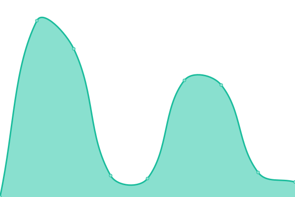

# [📈 Live Status](https://sflwa.github.io/sflwa-uptime): <!--live status--> **🟧 Partial outage**

This repository contains the open-source uptime monitor and status page for [sflwa](https://sflwa.github.io/sflwa-uptime), powered by [Upptime](https://github.com/upptime/upptime).

With [Upptime](https://upptime.js.org), you can get your own unlimited and free uptime monitor and status page, powered entirely by a GitHub repository. We use [Issues](https://github.com/sflwa/sflwa-uptime/issues) as incident reports, [Actions](https://github.com/sflwa/sflwa-uptime/actions) as uptime monitors, and [Pages](https://sflwa.github.io/sflwa-uptime) for the status page.

<!--start: status pages-->
<!-- This summary is generated by Upptime (https://github.com/upptime/upptime) -->
<!-- Do not edit this manually, your changes will be overwritten -->
<!-- prettier-ignore -->
| URL | Status | History | Response Time | Uptime |
| --- | ------ | ------- | ------------- | ------ |
|  [Temple Beth Orr](https://www.templebethorr.org) | 🟩 Up | [temple-beth-orr.yml](https://github.com/sflwa/sflwa-uptime/commits/HEAD/history/temple-beth-orr.yml) | 

 3385ms
     
 | 

<a href="https://sflwa.github.io/sflwa-uptime/history/temple-beth-orr">100.00%</a>
    

|  [Temple Torat Emet](https://www.templetoratemet.org) | 🟥 Down | [temple-torat-emet.yml](https://github.com/sflwa/sflwa-uptime/commits/HEAD/history/temple-torat-emet.yml) | 

 3470ms
     
 | 

<a href="https://sflwa.github.io/sflwa-uptime/history/temple-torat-emet">100.00%</a>
    

<!--end: status pages-->

[**Visit our status website →**](https://sflwa.github.io/sflwa-uptime)

## 📄 License

- Powered by: [Upptime](https://github.com/upptime/upptime)
- Code: [MIT](./LICENSE) © [sflwa](https://sflwa.github.io/sflwa-uptime)
- Data in the `./history` directory: [Open Database License](https://opendatacommons.org/licenses/odbl/1-0/)
